### **🌐INTRODUCTION** 

**Redmine**, a management application used by Koders is a web-based project management and issue tracking tool that allows users to manage multiple projects with features like wikis, forums, and time–tracking role-based access control. 

Be patient, because it takes spiritual reinforcement to successfully deal with Redmine, so sit back and follow the guide to a whole new venture. 

- Allows tracking of multiple projects 
- Supports flexible role-based access control. 
- Includes an issue tracking system.  
- Features a Gantt Chart and calendar 
- Integrates News, documents and files management 
- Allows web feeds and e-mail notifications. 

New to Redmine? Register yourself here ⬇️ 
[https://kore.koders.in/ ](https://kore.koders.in/) 

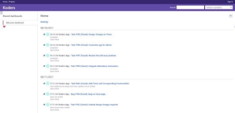

### **🗝️LOGIN** 

Once approved, by one our admins you’ll be able to login with the given **NAME** and **PASSWORD**. You will only be able to change the password after 7 days of resetting. 

Forget Password link will only be generated by the admin.                                After logging in, you’ll be redirected to the main page. 

### **🖥️ACCOUNT SETUP** 

On the top right corner of the page, **“My Account”** directs you to account management page which updates basic information and password. 

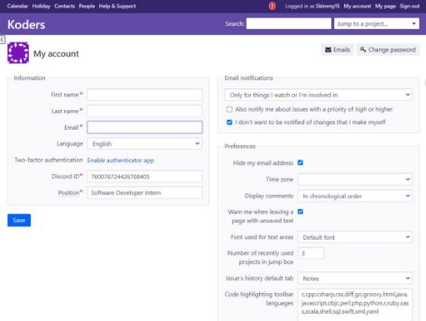

### **📂ISSUE SELECTION** 

On the top right corner, “Jump to a Project” lets you select the Project from the available options in the drop-down list, that you want to create. 

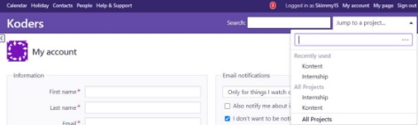

- Select an option (for ex: Internship) from the drop – down list and it will direct you to the Overview page which contains various features as Project Information, Time Tracking, Issue Tracking and Members. 

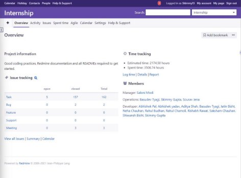

Create an Issue by updating all the details, where you can set deadline and estimated hours for the issue you create, can assign it to one of the members from your team and maintain a checklist for the same. 

**ISSUE TRACKING** helps you track the information with respect to the **ISSUE** you create which includes deadlines, estimated hours, spent time, watchers, assignee and log hours.  

##### **🔍PROJECT OVERVIEW** 

- **Project Information** – Gives information about all the features that are required to get started. 
- **Issue Tracking** – Keeps track of all the members that are assigned under the given project including developers, managers and project head.
- **Time Tracking** – Helps to log time that you have spent working on the new task, view details and report of the work done with the set deadlines.
- **Add Bookmark** – Helps add/remove bookmark to record the address of the issue and to enable them for quick access.

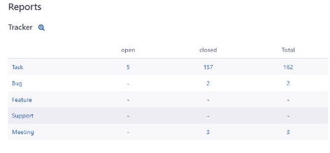

##### **📝PROJECT ACTIVITY** 

- Gives a log of activities that are carried out in the project. 

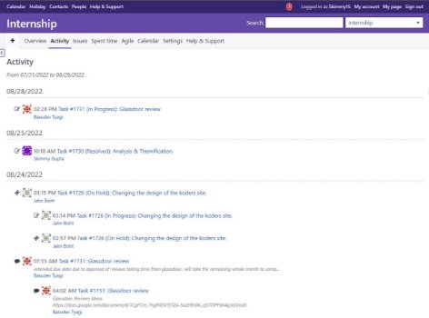

- ✒️A new issue has been updated or created. 
- 🔁The status of the issue has been changed (in progress, resolved or closed). 
- ✅ The issue has been closed by the project head. 
- ⏳Log hours of the issue has been updated. 
- 🖥️An attribute has been updated to the repository. 
- 📰News has been updated in the news area. 
- 📩A message has been added in the forum. 
- 🌐A wiki page has been edited or newly created. 
- 📃A new document has been added. 
- ⏲️Estimated time and date has been updated. 
- 📈Percent of work done updated in the issue. 

### 🧩**ISSUES** 

It will allow you to create new issues and update all the information regarding the same. List of all the projects created in the issue will be displayed. 

- **NEW ISSUE** - Creates new issue and repositories. 
- **FILTERS** – helps you select the status of the project provided by the project manager from the drop- down menu of the issue. 
- The details of the issue can be generated in serval formats such as **Comma Separated Values (CSV)** or **Portable Document Format (PDF)**. 

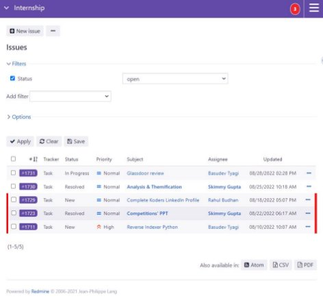

### **⏳SPENT TIME** 

Allows you to keep track of the log hours on a particular issue or project. **LOG TIME⏲️** 

- Fill in the required details of you log, add comments about your task, and update an activity to the task. 
- Log your hours less than 2 hours at a stretch and divide your task into sections and log it. 
- Get a detailed report on the spent time along with Date, Activity, Issue, Comment and Log Hours. 
- Status (resolved, completed or closed) of all other Projects/Tasks is displayed on the dashboard. 
- Get a complete report on spent time and estimated hours by applying appropriate filters to it.  

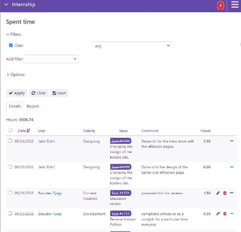

### **🌱RESOURCES** 

Adds a capacity planner with time tracking, workload and availability reporting. It makes it easy to add, edit and manage resource bookings using charts and widgets. 

- Schedule resources on tasks and projects. 
- Pop up to add/edit booking on the chart. 
- Time spent is displayed on the schedule. 
- Resource graphs for projects/tasks. 
- Filters and view configurations. 
- Colour indicators of the work load. 

### **💹AGILE BOARD** 

Agile board allows you to work with sprints, backlogs, tasks in backlog and their statuses.  

You can easily plan, visualize and manage your work during a series of consecutive sprints and can manage and measure the flow of work on the board. 

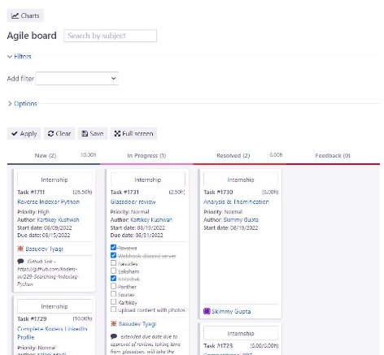

All your issue details will be listed under the Status it is currently deployed in. You can drag the issues from one column to other to update its status. 

- Defines story point estimation and values 
- Displays Charts such as Burndown, Velocity, Cumulative Flow. 
- Multiple boards and swim lanes for better display. 
- Displays tags and images of the issue. 
- Issues and Comments can be added to the board. 
- Details of all the issues are displayed such as assignee, author, deadlines 
- Can adjust the plugin setting for any methodology or workflow that your organization uses. 

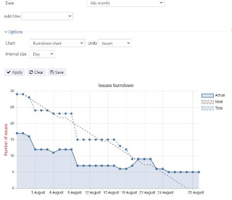

You can also view the Agile charts by clicking on Charts at the top-right corner and apply Filters as per your needs. Charts can be used to respond any unforeseen circumstances in your development process.   

##### **📉BURNDOWN CHARTS** 

Shows the amount of work that has been completed in an epic or sprint, and the total work remaining. They are used to predict your team’s likelihood of completing their work in the time available and are great for keeping the team aware of any scope creep that occurs. 

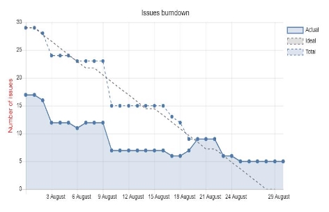

##### **📈BURNUP CHARTS** 

It shows the project progress over time. There are two main lines shown on the chart: one is for the total project work planned and the other for tracking the work completed to date. The chart slopes downward over the Sprint duration and across Story points completed. 

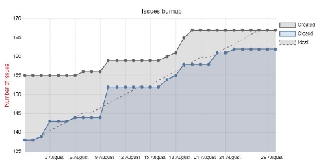

##### **💹CUMULATIVE FLOW** 

It lets the team visualize the progress of their projects. Teams can monitor the flow of work through its stages and gives the user the ability to predict blockers or disruptions in the progress of work. 

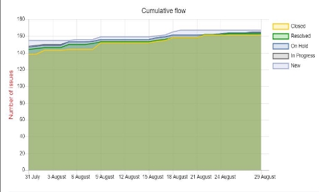

##### **📊VELOCITY** 

The chart shows how many issues were created and closed over time. 

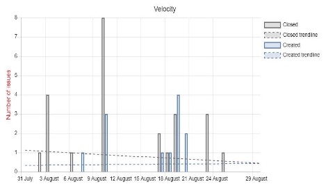

It provides you with the following information: 
- **CLOSED**: The number of issues closed. 
- **CREATED**: The number of issues created. 

##### **♻️TRACKER CUMULATIVE FLOW** 

The cumulative flow chart shows how many issues are currently in each of the  statuses. Probably the most important is the **In progress** part. If it increases or widens vertically with time, it means that there are some problems or bottlenecks along the way. This indicates delays in the project. A large increase in resolved stories may also indicate a bottleneck on the testing or acceptance stage. 

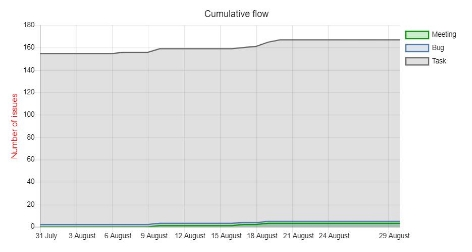

##### **🔁CYCLE TIME** 

It shows an average and total time spent to finish each task for each issue type over a selected timeline. 

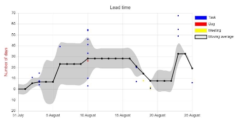

##### **🧮STORY POINT ESTIMATION** 

Story  points  are  recommended  for  Agile  teams  that  implement  Scrum  methodology  in particular. They are used to estimate the complexity and time needed to complete the task, all combined in one productivity metric. 

##### **🗓️CALENDAR** 

The  calendar  provides  an  overview  of  the  current project  as  a monthly view.  The  view displays all the issues that have at least start date and indicates their start date and their due date. The calendar also displays the versions which have a due date set. 

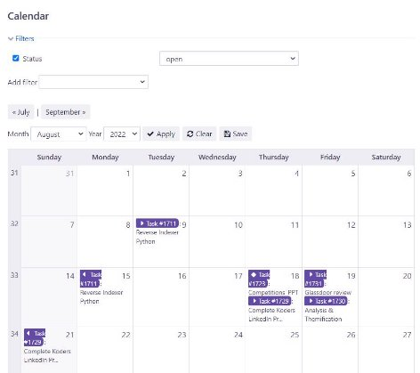

You can also define filters to view a subset of issues that can be shown on the calendar. 

**GANTT:** shows the summary of all the issues including the due date followed allowing the users to track the issues in a better format. 

### **📐SETTINGS** 

Members who have necessary permission in the project can configure the project on the projects’ settings tab. 

In this you can configure the basic settings for the selected project. 

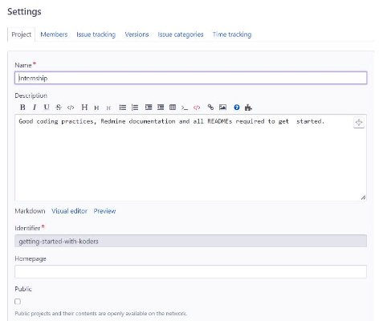

##### **🧩GENERAL SETTINGS** 

- **Name**: project display name. 
- **Description**: description that appears on the project overview. 
- **Identifier**: used by the application for various things (eg. in URLs). It must be unique and cannot be composed of only numbers. Once the project is created, this identifier cannot be modified. 
- **Homepage**: homepage-link that appears on the project overview.  
- **Public**: if checked, the project can be viewed by all the users, including those who are not members of the project. If unchecked, only the project members have access to it, according to their role.  
- **Subproject of**: lets you define a parent project to the project being created. Projects can be unlimitedly nested. 

If there are any project custom fields configured by the administrator, they'll show up behind the "Public"-setting noted above. 

- **Trackers**: select the trackers that you want to use for issues of the project. Only the administrator can define new trackers. 
- **Custom fields**: select the issue custom fields that you want to use for issues of the project. Only the administrator can define new custom fields. 

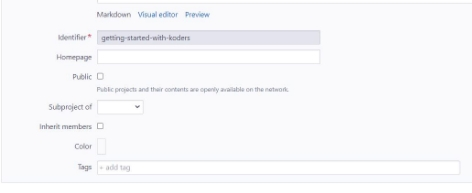

##### **👨🏾‍🤝‍👨🏼MEMBERS** 

This screen lets you define project members and their roles. You can add a user or a group, with one or multiple role(s) in a given project. 

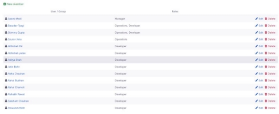

##### **📊VERSIONS** 

Projects versions allow you to track and plan changes. You can assign issues to versions and then view the list of assigned issues for each version on the roadmap.  

You can also assign a wikipage to a version which will be added to the roadmap and the version overview. 

The following properties are configurable for (each of the) versions: 

- **Name**: The text you want to display for identifying the version. 
- **Description**: A short description of the displayed version.  
- **Status**: the status lets you control how issues can be assigned in version.
 **🔸open**: no restriction (default) 
**🔸locked**: cannot assign new issues to the version 
**🔸closed**: cannot reopen assigned issues 
- **Wiki Page**: The name of page assigned to the version.  
- **Due date**: The deadline of the version to be completed.  
- **Sharing**: Lets you share the version with other projects. Each version can be shared with: 
 **🔹subprojects**: all the descendant projects 
**🔹projects in the project hierarchy**: needs versions management permission on the root project.
**🔹projects in the project tree**: root project + all its descendants 
 **🔹all projects** (can be set by admin users only) 
- Sharing a version of a private project with public projects will make its name visible to everyone. 
- From the versions list, you can click on **Close Completed Versions** to automatically set the status of all the completed versions to **closed**. 

##### **🟡ISSUE CATEGORIES** 

Issue categories let you to organize issues. 
Categories display the different components of the projects.

You are able to configure your own set of issue categories for each individual project. It is also possible to auto-assign new issues to a specific user based on the chosen category of the newly created issues. 

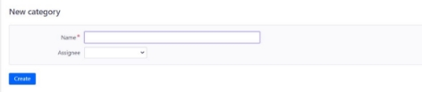

The following properties are configurable for (each of the) issue categories: 

- **Name**: The text you want to be displayed to identify the issue category. 
- **Assigned to**: The project member to who you want to auto-assign newly created issues in this category.  

##### **⏳TIME TRACKING** 

 Time tracking allows users to track how many hours of work are logged to a specific issue or project. Each time entry of "spent time" can be categorized by activity, and is further explained with comments. By filling time estimates, project managers are able to produce better planned projects.

Time tracking is always related to a user; thus, it can be used to track how many billable hours you have accomplished. 

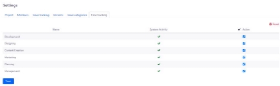

##### **🌐WIKI**

Each project can have its own wiki. Enable the module on the desired project to activate it. 

- **Start page**: This page is used as the start page for the wiki in both the project menu link as well as in the start page link at the sidebar. 

##### **🗃️REPOSITORY** 

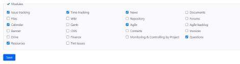

A SCM repository can be associated with each project. Once the repository is configured, you can browse it and view the changesets. The changesets also appear in the Activity overview. 

##### **📃FORUMS** 

Each project can have one or more discussion forums. Each forum has the following properties: 

- **Name**: The text you want to be displayed to identify the discussion forum.  
- **Description**: A short description to describe the subject of the specific forum. 

##### **🤖ACTIVITIES** 

Among the value of time tracking activities, which is registered to enumerations, can be excluded when not used in the project. 

The value which is unchecked and is **"Enabled"** on this screen, do not appears in activity section when entering time log.

##### **🎦DOCUMENTS AND FILES**  

In this you will be allowed to create new documents with both text and files. The notes could be kept for further use and can be updated under the documents section for everyone to access. 

### **🌟HELP AND SUPPORT** 

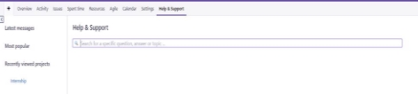

- Creates per-customer project 
- Create custom “customer” role with appropriate permissions 
- You can View/open/watch/edit/close the issues 
- Total Time Spent is displayed. 

##### **🔗️ADD – ON FEATURES**
**🟡HOME**: directing to main page 

**🟢MY PAGE**: showing the issues assigned to you and the issues that you have reported. Projects: contains the list of projects 

**🟣SEARCH**: Search words or sentences in the topic and content of issues. 

**🔵DROP-DOWN LIST**: shows projects related to you and allows you to jump on the project page. After selecting the project, you want, the overview of the project will show up. 

**🟡ISSUES**: shows all open issues 

**🟢NEW ISSUES**: allows creation of new issues 

**🟣DOCUMENTS**: shows already uploaded records 

**🔵SUBJECT** and **DESCRIPTION** let you add details about the issue.                                  

**🟡FILES**: helps attach files with maximum size. 

**🟢WATCHERS**: the people selected from the drop-down menu will receive email about every update of the particular issue. 

**🟣STATUS**: shows the status of the issue (new, in progress, resolved or closed). 

**🔵PRIORITY**: shows the importance of the issue. 

**🟡ASSIGNEE**: helps in the selection of the people for the project assigned. 

**🟢DUE DATE**: specifies a deadline for the issue. 

**🟣ESTIMATED TIME**: hours taken to complete the issue. 

🔵By clicking the issue, you’ll be able to enter the issue and see the description and updated details of the issue. 

**🟡UPDATE**: adding updates to the issues. 

**🟢WATCH/UNWATCH**: shows whether you are a watcher of the assigned issue, and could be modified by clicking it. 

🟣In a particular issue, after clicking **“UPDATE”**, a section will show up which allows user to enter details. In this section, you will be able to change the properties of the issue. 

🔵The **LOG TIME** section let users record the time spent on the particular issue and allows uploading of the attachment. 

🟡People can always check the update history under the particular issue assigned. 

🟢If the issue gets completed, change the status of the issue to **RESOLVED**, and the managers assigned to the project will close the issue, which removes the issue from **OPEN** issue list. 

#### **Made with ❤️ by Koders**

